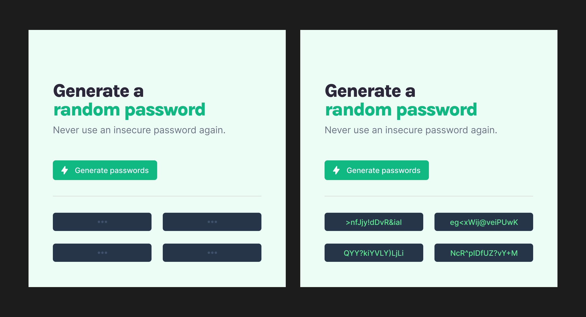

# Password Generator

Scrimba - Module 3.4 - Solo Project - Password Generator

This project was completed as part of the [Scrimba](https://scrimba.com/) [Frontend Career Path](https://scrimba.com/learn/frontend/) curriculum.

## Live Website

View the [live site]()

## Learning Goals

Implement a basic JavaScript application based on a given list of specifications and design file.

## Core Requirements

- [ ] Array to hold all possible chars
- [ ] Button to generate 4 random password options
- [ ] Display password options

## Stretch Requirements

- [ ] Ability to set password length
- [ ] 1-click copy password to the clipboard

## Additional Personal Stretch Requirements

- [ ] Option to turn symbols and numbers on and off

These are requirements I added to challenge myself further.
These come from noticing improvements that could be made while completing the core and stretch project requirements.

## Design

The design will be as per the the image below specified by the designer. See the complete [Figma project here](https://www.figma.com/file/Uq076mraPyBMRYoVwVsd4N/Random-Password-Generator?node-id=0%3A1).

## Author

Michael McGee [@m3t4m1k3](https://github.com/m3t4m1k3)

## TODO

- [ ]
